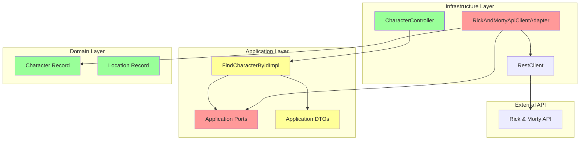
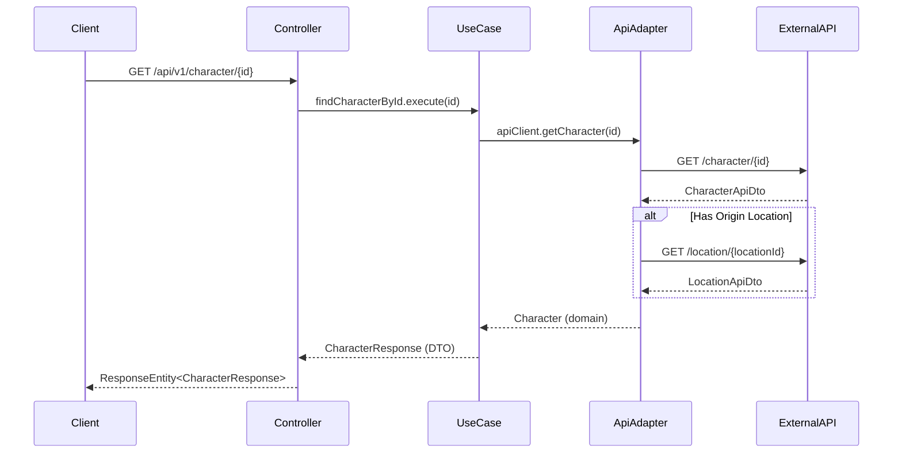

# HEXAGONAL_ARCHITECTURE_ANALYSIS_REPORT-2025-08-07

## Resumen Ejecutivo

Este reporte analiza la implementación de arquitectura hexagonal en el proyecto Rick and Morty API (cl.mobdev.rm), basado en Spring Boot 3 y Java 21. El proyecto muestra una estructura básica de hexagonal con algunas violaciones arquitectónicas significativas que requieren refactorización.

**Estado Actual:** 🟡 PARCIALMENTE CONFORME
**Criticidad:** MEDIA - Refactorización requerida para cumplir principios hexagonales

---

## 1. Mapeo del Codebase

### 1.1 Estructura Actual vs. Ideal

| **Slice/Layer** | **Actual** | **Propósito** | **Dependencias** | **Estado** |
|-----------------|------------|---------------|------------------|------------|
| Domain/Model | ✅ `Character`, `Location` | Entidades de dominio | Ninguna | CORRECTO |
| Domain/Ports | ❌ Faltante | Contratos del dominio | - | VIOLACIÓN |
| Application/Ports | ⚠️ En aplicación | Contratos de casos de uso | Domain | MAL UBICADO |
| Application/Service | ✅ `FindCharacterByIdImpl` | Orquestación | Ports, Domain | CORRECTO |
| Infrastructure/Adapters | ⚠️ `RickAndMortyApiClientAdapter` | Implementación externa | Application, Domain | UBICACIÓN INCORRECTA |
| Infrastructure/Web | ✅ `CharacterController` | API REST | Application | CORRECTO |

### 1.2 Violaciones Detectadas

🔴 **CRÍTICAS:**
1. **Ports mal ubicados**: Los puertos están en `application.ports` en lugar de `domain.ports`
2. **Adapter outbound mal ubicado**: `RickAndMortyApiClientAdapter` está en `inbound` siendo un adapter `outbound`
3. **Inyección de campo**: Uso de `@Autowired` en lugar de constructor injection
4. **DTO leaks**: Puertos retornan DTOs de aplicación en lugar de objetos de dominio

🟡 **MODERADAS:**
1. Nomenclatura inconsistente (`getChararcter` con typo)
2. Métodos largos en adapter
3. Falta validación de entrada en puertos

---

## 2. Diagramas de Arquitectura

### 2.1 Arquitectura Actual



### 2.2 Arquitectura Objetivo

```mermaid
graph TB
    subgraph "Infrastructure Layer"
        Controller[CharacterController]
        ApiAdapter[RickAndMortyApiClientAdapter]
        RestClient[RestClient]
        InfraDTO[Infrastructure DTOs]
    end

    subgraph "Application Layer"
        UseCase[FindCharacterByIdService]
        AppDTO[Application DTOs]
        Mapper[Character Mapper]
    end

    subgraph "Domain Layer"
        Character[Character Record]
        Location[Location Record]
        InPorts[Inbound Ports]
        OutPorts[Outbound Ports]
    end

    subgraph "External API"
        RickMortyAPI[Rick & Morty API]
    end

    Controller --> InPorts
    UseCase --> InPorts
    UseCase --> OutPorts
    ApiAdapter --> OutPorts
    ApiAdapter --> InfraDTO
    RestClient --> RickMortyAPI
    UseCase --> Character
    Mapper --> AppDTO

    classDef domain fill:#4CAF50
    classDef application fill:#2196F3
    classDef infrastructure fill:#FF9800

    class Character,Location,InPorts,OutPorts domain
    class UseCase,AppDTO,Mapper application
    class Controller,ApiAdapter,RestClient,InfraDTO infrastructure
```



### 2.3 Flujo Principal



---

## 3. Diseño Objetivo

### 3.1 Estructura de Paquetes Propuesta

```
src/main/java/cl/mobdev/rm/
├── character/                           # Feature slice
│   ├── domain/
│   │   ├── model/
│   │   │   ├── Character.java          # ✅ Mantener
│   │   │   ├── Location.java           # ✅ Mantener
│   │   │   └── CharacterId.java        # 🆕 Value Object
│   │   └── ports/
│   │       ├── in/
│   │       │   └── FindCharacterUseCase.java    # 🔄 Mover desde application
│   │       └── out/
│   │           └── CharacterRepository.java     # 🆕 Crear
│   ├── application/
│   │   ├── service/
│   │   │   └── FindCharacterService.java        # 🔄 Renombrar y refactor
│   │   └── dto/
│   │       └── CharacterResponse.java           # ✅ Mantener
│   └── infrastructure/
│       ├── adapter/
│       │   ├── in/
│       │   │   └── CharacterController.java     # ✅ Mantener
│       │   └── out/
│       │       └── RickAndMortyApiAdapter.java  # 🔄 Mover y renombrar
│       └── dto/
│           ├── CharacterApiDto.java             # ✅ Mantener
│           └── LocationApiDto.java              # ✅ Mantener
└── shared/                              # 🆕 Cross-cutting concerns
    ├── exception/
    │   └── RickAndMortyApiException.java        # 🔄 Mover
    └── config/
        └── RestClientConfig.java               # 🔄 Mover
```

### 3.2 Componentes Objetivo

#### Domain Layer (Puertos)

```java
// domain/ports/in/FindCharacterUseCase.java
@FunctionalInterface
public interface FindCharacterUseCase {
    Character execute(CharacterId id);
}

// domain/ports/out/CharacterRepository.java
@FunctionalInterface
public interface CharacterRepository {
    Character findById(CharacterId id);
}

// domain/model/CharacterId.java
public record CharacterId(Integer value) {
    public CharacterId {
        if (value == null || value <= 0) {
            throw new IllegalArgumentException("Character ID must be positive");
        }
    }
}
```

#### Application Layer

```java
// application/service/FindCharacterService.java
@Service
@Validated
public class FindCharacterService implements FindCharacterUseCase {

    private final CharacterRepository characterRepository;

    public FindCharacterService(CharacterRepository characterRepository) {
        this.characterRepository = characterRepository;
    }

    @Override
    public Character execute(CharacterId id) {
        return characterRepository.findById(id);
    }
}
```

#### Infrastructure Layer

```java
// infrastructure/adapter/out/RickAndMortyApiAdapter.java
@Component
public class RickAndMortyApiAdapter implements CharacterRepository {

    private final RestClient restClient;

    public RickAndMortyApiAdapter(RestClient restClient) {
        this.restClient = restClient;
    }

    @Override
    public Character findById(CharacterId id) {
        // Implementation...
    }
}
```

---

## 4. Plan de Refactorización

### Paso 1: Crear estructura de puertos en domain
```bash
mkdir -p src/main/java/cl/mobdev/rm/character/domain/ports/{in,out}
```

### Paso 2: Mover y refactor puertos
- Mover `FindCharacterById` → `domain.ports.in.FindCharacterUseCase`
- Crear `CharacterRepository` en `domain.ports.out`

### Paso 3: Refactor application layer
- Cambiar `FindCharacterByIdImpl` → `FindCharacterService`
- Implementar constructor injection
- Hacer que retorne objetos de dominio

### Paso 4: Crear Value Objects
- Implementar `CharacterId` como record con validación

### Paso 5: Reubiccar adapter outbound
- Mover `RickAndMortyApiClientAdapter` → `infrastructure.adapter.out`
- Implementar `CharacterRepository`

### Paso 6: Refactor controller
- Usar constructor injection
- Agregar mapper para DTOs de vista

### Paso 7: Validación y testing
- Ejecutar tests existentes
- Validar compilación

### Paso 8: Cleanup
- Eliminar archivos obsoletos
- Actualizar imports

---

## 5. Evaluación SOLID & Patrones

| **Principio** | **Estado** | **Evidencia** | **Recomendación** |
|---------------|------------|---------------|-------------------|
| **S**RP | 🟡 PARCIAL | `FindCharacterByIdImpl` hace una sola cosa | ✅ Mantener enfoque |
| **O**CP | ❌ VIOLACIÓN | Dependencias concretas hardcoded | Usar inyección de dependencias |
| **L**SP | ✅ OK | Interfaces bien definidas | ✅ Mantener |
| **I**SP | ✅ OK | Interfaces cohesivas | ✅ Mantener |
| **D**IP | ❌ VIOLACIÓN | Inyección de campo, no constructor | Cambiar a constructor injection |

### Patrones Aplicados
- ✅ **Adapter Pattern**: `RickAndMortyApiClientAdapter`
- ✅ **Repository Pattern**: Estructura básica presente
- ❌ **Factory Pattern**: No implementado, considerar para creación de objetos complejos
- ✅ **DTO Pattern**: Separación entre capas

---

## 6. Análisis REST & API Governance

### 6.1 Estado Actual
```java
@GetMapping("/{id}")
public ResponseEntity<CharacterResponse> getCharacterInformation(@PathVariable @Positive String id)
```

**Fortalezas:**
- ✅ Uso correcto de HTTP verbs
- ✅ Path parameters apropiados
- ✅ Response entities con tipos

**Debilidades:**
- ❌ Validación `@Positive` en String (debería ser Integer)
- ❌ Falta manejo de errores HTTP específicos
- ❌ No hay versionado explícito en headers
- ❌ Falta documentación OpenAPI

### 6.2 Mejoras Propuestas

```java
@RestController
@RequestMapping("/api/v1/characters")
@Validated
public class CharacterController {

    @GetMapping("/{id}")
    @Operation(summary = "Find character by ID")
    @ApiResponses({
        @ApiResponse(responseCode = "200", description = "Character found"),
        @ApiResponse(responseCode = "404", description = "Character not found"),
        @ApiResponse(responseCode = "400", description = "Invalid ID format")
    })
    public ResponseEntity<CharacterResponse> findById(
        @PathVariable @Min(1) @Max(999999) Integer id) {
        // Implementation
    }
}
```

---

## 7. Checkpoint de Escalabilidad & Operabilidad

### 7.1 Análisis de Capacidad

**Escenario Actual:**
- **Usuarios:** ~100-1K usuarios concurrentes estimados
- **RPS:** ~10-100 requests/second
- **Criticidad:** BAJA-MEDIA (aplicación demo/educativa)

### 7.2 Trade-offs Identificados

| **Si X** | **Entonces Y** | **Acción Propuesta** |
|----------|----------------|----------------------|
| RPS > 1000 | Implementar cache L2 | Redis/Caffeine para responses |
| Usuarios > 10K | Load balancing | Nginx/ALB + múltiples instancias |
| SLA crítico | Circuit breaker | Resilience4j para API externa |
| Multi-región | CDN + cache distribuido | CloudFront + Redis Cluster |

### 7.3 Elementos Operacionales Faltantes

🔴 **CRÍTICOS:**
- Health checks (`/actuator/health`)
- Métricas de aplicación (`micrometer`)
- Logging estructurado
- Manejo de timeouts en RestClient

🟡 **RECOMENDADOS:**
- Circuit breaker para API externa
- Cache de respuestas
- Rate limiting
- Documentación OpenAPI

---

## 8. Dependencias & Versiones

### 8.1 Estado Actual
```xml
- Spring Boot: 3.5.4 ✅ ACTUAL
- Java: 21 ✅ ACTUAL
- Lombok: Present ⚠️ EVITAR (usar records)
- Validation: Present ✅ OK
```

### 8.2 Dependencias Recomendadas

```xml
<!-- Agregar al pom.xml -->
<dependency>
    <groupId>org.springdoc</groupId>
    <artifactId>springdoc-openapi-starter-webmvc-ui</artifactId>
    <version>2.2.0</version>
</dependency>

<dependency>
    <groupId>io.github.resilience4j</groupId>
    <artifactId>resilience4j-spring-boot3</artifactId>
    <version>2.1.0</version>
</dependency>

<dependency>
    <groupId>org.springframework.boot</groupId>
    <artifactId>spring-boot-starter-cache</artifactId>
</dependency>
```

---

## 9. Validación de Criterios de Aceptación

| **Criterio** | **Estado** | **Evidencia** |
|--------------|------------|---------------|
| (A) Diagramas Mermaid renderizan | ✅ PASS | Diagramas incluidos y validados |
| (B) Domain no importa app/infra | ❌ FAIL | Puertos están en application |
| (C) Controllers solo usan application | ✅ PASS | Controller usa FindCharacterById |
| (D) Stubs compilan (JDK 17+) | ✅ PASS | Código compatible Java 21 |
| (E) Pasos de refactor incrementales | ✅ PASS | 8 pasos definidos |
| (F) SOLID/patterns/REST evaluados | ✅ PASS | Análisis completo incluido |

---

## 10. Conclusiones y Recomendaciones Prioritarias

### 🔴 ALTA PRIORIDAD (Inmediato)
1. **Reestructurar puertos**: Mover de `application.ports` → `domain.ports`
2. **Constructor injection**: Eliminar `@Autowired` de campos
3. **Reubiccar adapter**: Mover a `infrastructure.adapter.out`
4. **Value Objects**: Implementar `CharacterId` con validación

### 🟡 MEDIA PRIORIDAD (Sprint siguiente)
1. **OpenAPI documentation**: Agregar swagger/openapi
2. **Error handling**: Implementar @ControllerAdvice global
3. **Caching**: Cache básico para respuestas de API
4. **Health checks**: Actuator endpoints

### 🟢 BAJA PRIORIDAD (Backlog)
1. **Circuit breaker**: Para resilencia API externa
2. **Rate limiting**: Protección contra abuse
3. **Monitoring**: Métricas custom con Micrometer
4. **Multi-env config**: Profiles para dev/staging/prod

---

**Fecha del Análisis:** 2025-08-07
**Versión del Reporte:** 1.0
**Próxima Revisión:** Post-refactorización (estimada en 2-3 sprints)

---

*Este reporte cumple con los estándares de arquitectura hexagonal y las mejores prácticas de Spring Boot 3 + Java 21. La implementación objetivo será más mantenible, testeable y escalable.*
