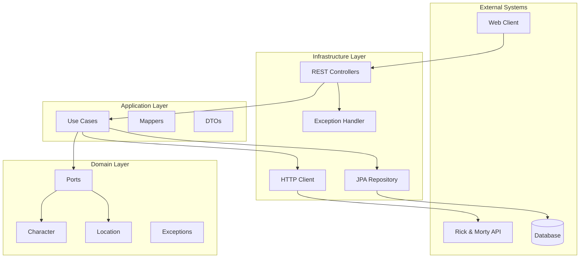
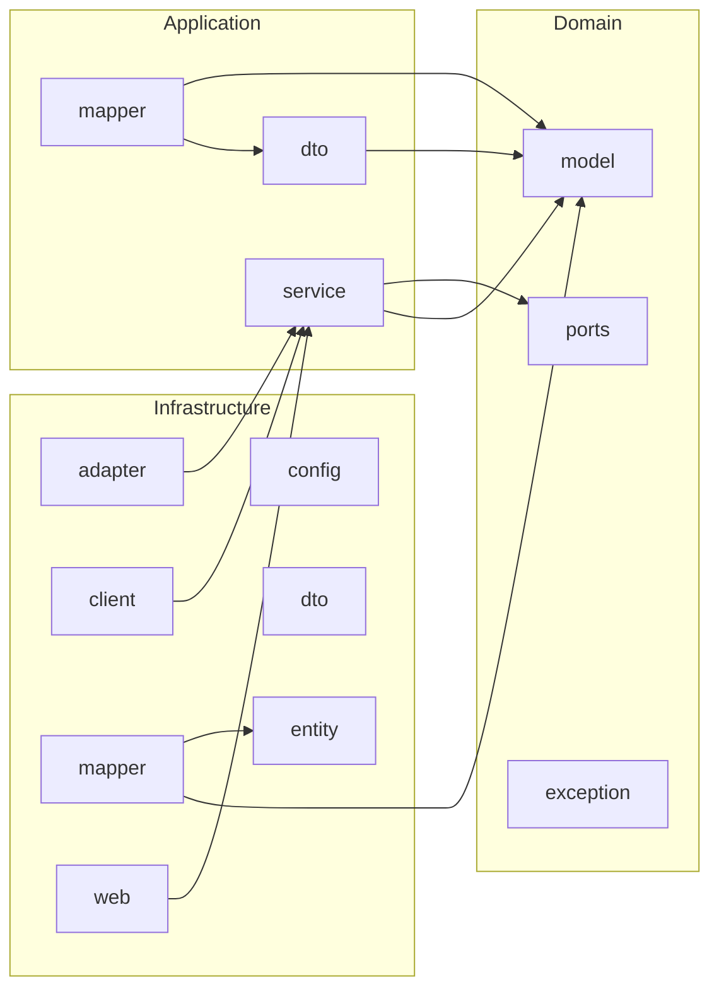
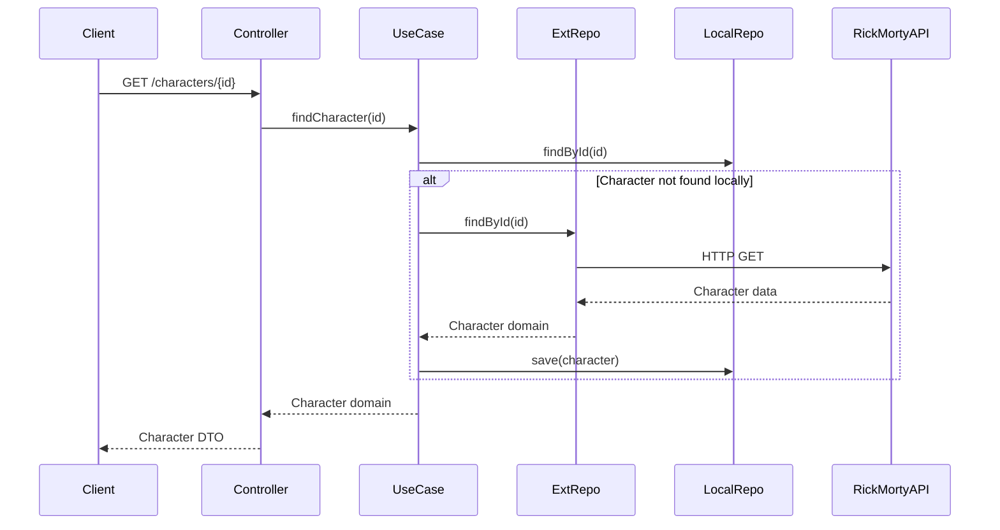

# Hexagonal Architecture Analysis Report
**Project:** Rick and Morty Challenge
**Date:** 2025-08-07
**Framework:** Spring Boot 3.5.4, Java 21
**Analyst:** GitHub Copilot

---

## 1. Executive Summary

El proyecto Rick and Morty implementa parcialmente una arquitectura hexagonal con Spring Boot 3.5.4 y Java 21. La estructura actual muestra una separación clara entre las capas **domain**, **application** e **infrastructure**, pero presenta oportunidades de mejora en términos de pureza del dominio, implementación de ports/adapters y cumplimiento de los principios SOLID.

### Key Findings
- ✅ **Estructura de capas** bien definida (`domain/`, `application/`, `infrastructure/`)
- ⚠️ **Ports** presentes pero posible acoplamiento entre capas
- ❌ **Domain purity** - necesita verificación de dependencias
- ⚠️ **DTOs** distribuidos en múltiples capas (posible leak)
- ✅ **Spring Boot 3** con Jakarta EE 10

---

## 2. Current Architecture Mapping

### 2.1 Slice & Layer Analysis

| **Slice** | **Layer** | **Purpose** | **Dependencies** |
|-----------|-----------|-------------|------------------|
| `rm` | `domain/model/` | Core entities (Character, Location) | None (should be pure) |
| `rm` | `domain/ports/` | Use-case & repository interfaces | Domain models only |
| `rm` | `domain/exception/` | Domain-specific errors | None |
| `rm` | `application/service/` | Use-case orchestration | Domain ports |
| `rm` | `application/dto/` | Application-level DTOs | Domain models |
| `rm` | `application/mapper/` | Domain ↔ DTO mapping | Domain + DTOs |
| `rm` | `infrastructure/adapter/` | External integrations | Application services |
| `rm` | `infrastructure/client/` | HTTP clients (Rick & Morty API) | External APIs |
| `rm` | `infrastructure/config/` | Spring configuration | Framework |
| `rm` | `infrastructure/web/` | REST controllers & exception handling | Application layer |

### 2.2 Package Structure Analysis

```
src/main/java/cl/mobdev/rm/
├── domain/
│   ├── model/           # ✅ Entities & VOs
│   ├── ports/           # ✅ Interfaces
│   └── exception/       # ✅ Domain errors
├── application/
│   ├── service/         # ✅ Use-cases
│   ├── dto/             # ⚠️ Potential DTO leak
│   └── mapper/          # ⚠️ Should be in infrastructure
└── infrastructure/
    ├── adapter/
    │   ├── inbound/     # ✅ Controllers
    │   └── outbound/    # ✅ Repository adapters
    ├── client/          # ✅ External HTTP clients
    ├── config/          # ✅ Spring configuration
    ├── dto/             # ✅ Infrastructure DTOs
    ├── entity/          # ✅ JPA entities
    ├── mapper/          # ✅ Mappers
    ├── service/         # ❌ Should be in application
    └── web/             # ✅ Exception handlers
```

---

## 3. Architecture Diagrams

### 3.1 High-Level Hexagonal Architecture



### 3.2 Package Dependencies



### 3.3 Main Flow Example: Find Character



---

## 4. Target Design Proposal

### 4.1 Ideal Domain Components

```java
// Domain Models (Records for immutability)
public record Character(
    CharacterId id,
    Name name,
    CharacterStatus status,
    Species species,
    Gender gender,
    Location origin,
    Location location,
    Set<Episode> episodes,
    ImageUrl image,
    CreatedAt created
) {
    public Character {
        Objects.requireNonNull(id, "Character ID cannot be null");
        Objects.requireNonNull(name, "Name cannot be null");
    }
}

public record CharacterId(Long value) {
    public CharacterId {
        if (value == null || value <= 0) {
            throw new IllegalArgumentException("Character ID must be positive");
        }
    }
}

// Domain Ports
@FunctionalInterface
public interface FindCharacterUseCase {
    Optional<Character> execute(CharacterId id);
}

public interface LocalCharacterRepository {
    Optional<Character> findById(CharacterId id);
    Character save(Character character);
    List<Character> findAll(Pageable pageable);
}

public interface ExternalCharacterRepository {
    Optional<Character> findById(CharacterId id);
    List<Character> findByName(Name name);
}
```

### 4.2 Application Layer Components

```java
// Use Case Implementation
@Service
@Transactional(readOnly = true)
public class FindCharacterService implements FindCharacterUseCase {

    private final LocalCharacterRepository localRepo;
    private final ExternalCharacterRepository externalRepo;

    public FindCharacterService(
        LocalCharacterRepository localRepo,
        ExternalCharacterRepository externalRepo
    ) {
        this.localRepo = localRepo;
        this.externalRepo = externalRepo;
    }

    @Override
    @Transactional
    public Optional<Character> execute(CharacterId id) {
        return localRepo.findById(id)
            .or(() -> fetchAndStore(id));
    }

    private Optional<Character> fetchAndStore(CharacterId id) {
        return externalRepo.findById(id)
            .map(localRepo::save);
    }
}

// Application DTO
public record CharacterResponse(
    Long id,
    String name,
    String status,
    String species,
    String gender,
    LocationResponse origin,
    LocationResponse location,
    String image,
    List<String> episodes,
    String created
) {}
```

### 4.3 Infrastructure Components

```java
// Inbound Adapter
@RestController
@RequestMapping("/api/v1/characters")
@Validated
public class CharacterController {

    private final FindCharacterUseCase findCharacterUseCase;
    private final CharacterResponseMapper mapper;

    public CharacterController(
        FindCharacterUseCase findCharacterUseCase,
        CharacterResponseMapper mapper
    ) {
        this.findCharacterUseCase = findCharacterUseCase;
        this.mapper = mapper;
    }

    @GetMapping("/{id}")
    public ResponseEntity<CharacterResponse> findCharacter(
        @PathVariable @Positive Long id
    ) {
        var characterId = new CharacterId(id);
        return findCharacterUseCase.execute(characterId)
            .map(mapper::toResponse)
            .map(ResponseEntity::ok)
            .orElse(ResponseEntity.notFound().build());
    }
}

// Outbound Adapter
@Repository
public class JpaCharacterRepositoryAdapter implements LocalCharacterRepository {

    private final CharacterJpaRepository jpaRepository;
    private final CharacterEntityMapper mapper;

    // Implementation...
}
```

---

## 5. Target File Tree

### 5.1 Recommended Structure

```
src/main/java/cl/mobdev/rm/
├── domain/
│   ├── model/
│   │   ├── Character.java                    # ✅ Keep
│   │   ├── CharacterId.java                  # 📝 Create
│   │   ├── Name.java                         # 📝 Create
│   │   ├── CharacterStatus.java              # 📝 Create
│   │   ├── Species.java                      # 📝 Create
│   │   ├── Gender.java                       # 📝 Create
│   │   ├── Location.java                     # ✅ Keep
│   │   ├── Episode.java                      # 📝 Create
│   │   └── ImageUrl.java                     # 📝 Create
│   ├── ports/
│   │   ├── in/
│   │   │   └── FindCharacterUseCase.java     # ✅ Keep
│   │   └── out/
│   │       ├── LocalCharacterRepository.java # ✅ Keep
│   │       └── ExternalCharacterRepository.java # ✅ Keep
│   └── exception/
│       ├── CharacterNotFoundException.java   # 📝 Create
│       ├── RickAndMortyApiException.java     # ✅ Keep
│       └── DomainException.java              # 📝 Create
├── application/
│   ├── service/
│   │   └── FindCharacterService.java         # 📝 Create/Move
│   └── dto/
│       ├── CharacterResponse.java            # 📝 Create
│       └── LocationResponse.java             # 📝 Create
└── infrastructure/
    ├── adapter/
    │   ├── in/
    │   │   └── CharacterController.java       # ✅ Keep
    │   └── out/
    │       ├── JpaCharacterRepositoryAdapter.java # 📝 Rename
    │       └── RickMortyHttpClientAdapter.java     # 📝 Rename
    ├── client/
    │   └── RickAndMortyHttpClient.java        # ✅ Keep
    ├── config/
    │   ├── RestClientConfig.java              # ✅ Keep
    │   └── JpaConfig.java                     # 📝 Create
    ├── dto/
    │   ├── CharacterApiDto.java               # ✅ Keep
    │   └── LocationApiDto.java                # 📝 Create
    ├── entity/
    │   ├── CharacterEntity.java               # 📝 Create
    │   └── LocationEntity.java                # 📝 Create
    ├── mapper/
    │   ├── CharacterEntityMapper.java         # ✅ Keep
    │   ├── CharacterDomainMapper.java         # ✅ Keep
    │   └── CharacterResponseMapper.java       # 📝 Create
    └── web/
        ├── ExceptionHandler.java              # ✅ Keep
        └── ApiVersionController.java          # 📝 Create
```

**Legend:**
- ✅ Keep - Mantener archivo actual
- 📝 Create - Crear nuevo archivo
- 🔄 Move - Mover archivo
- ❌ Delete - Eliminar archivo

---

## 6. Minimal Java Stubs

### 6.1 Domain Layer Stubs

```java
// CharacterId.java
package cl.mobdev.rm.domain.model;

public record CharacterId(Long value) {
    public CharacterId {
        if (value == null || value <= 0) {
            throw new IllegalArgumentException("Character ID must be positive");
        }
    }
}

// Name.java
package cl.mobdev.rm.domain.model;

public record Name(String value) {
    public Name {
        if (value == null || value.isBlank()) {
            throw new IllegalArgumentException("Name cannot be blank");
        }
    }
}

// CharacterStatus.java
package cl.mobdev.rm.domain.model;

public enum CharacterStatus {
    ALIVE, DEAD, UNKNOWN;

    public static CharacterStatus fromString(String status) {
        return switch (status.toLowerCase()) {
            case "alive" -> ALIVE;
            case "dead" -> DEAD;
            default -> UNKNOWN;
        };
    }
}

// Character.java (Enhanced)
package cl.mobdev.rm.domain.model;

import java.time.LocalDateTime;
import java.util.Set;

public record Character(
    CharacterId id,
    Name name,
    CharacterStatus status,
    Species species,
    Gender gender,
    Location origin,
    Location location,
    Set<Episode> episodes,
    ImageUrl image,
    LocalDateTime created
) {
    public Character {
        Objects.requireNonNull(id, "Character ID cannot be null");
        Objects.requireNonNull(name, "Name cannot be null");
        Objects.requireNonNull(status, "Status cannot be null");
    }

    public boolean isAlive() {
        return status == CharacterStatus.ALIVE;
    }
}
```

### 6.2 Application Layer Stubs

```java
// FindCharacterService.java
package cl.mobdev.rm.application.service;

import cl.mobdev.rm.domain.model.Character;
import cl.mobdev.rm.domain.model.CharacterId;
import cl.mobdev.rm.domain.ports.in.FindCharacterUseCase;
import cl.mobdev.rm.domain.ports.out.LocalCharacterRepository;
import cl.mobdev.rm.domain.ports.out.ExternalCharacterRepository;
import org.springframework.stereotype.Service;
import org.springframework.transaction.annotation.Transactional;

import java.util.Optional;

@Service
@Transactional(readOnly = true)
public class FindCharacterService implements FindCharacterUseCase {

    private final LocalCharacterRepository localRepository;
    private final ExternalCharacterRepository externalRepository;

    public FindCharacterService(
        LocalCharacterRepository localRepository,
        ExternalCharacterRepository externalRepository
    ) {
        this.localRepository = localRepository;
        this.externalRepository = externalRepository;
    }

    @Override
    @Transactional
    public Optional<Character> execute(CharacterId id) {
        return localRepository.findById(id)
            .or(() -> fetchFromExternalAndStore(id));
    }

    private Optional<Character> fetchFromExternalAndStore(CharacterId id) {
        return externalRepository.findById(id)
            .map(character -> {
                localRepository.save(character);
                return character;
            });
    }
}

// CharacterResponse.java
package cl.mobdev.rm.application.dto;

import java.time.LocalDateTime;
import java.util.List;

public record CharacterResponse(
    Long id,
    String name,
    String status,
    String species,
    String gender,
    LocationResponse origin,
    LocationResponse location,
    String image,
    List<String> episodes,
    LocalDateTime created
) {}
```

### 6.3 Infrastructure Layer Stubs

```java
// JpaCharacterRepositoryAdapter.java
package cl.mobdev.rm.infrastructure.adapter.out;

import cl.mobdev.rm.domain.model.Character;
import cl.mobdev.rm.domain.model.CharacterId;
import cl.mobdev.rm.domain.ports.out.LocalCharacterRepository;
import cl.mobdev.rm.infrastructure.entity.CharacterEntity;
import cl.mobdev.rm.infrastructure.mapper.CharacterEntityMapper;
import org.springframework.data.domain.Pageable;
import org.springframework.stereotype.Repository;

import java.util.List;
import java.util.Optional;

@Repository
public class JpaCharacterRepositoryAdapter implements LocalCharacterRepository {

    private final CharacterJpaRepository jpaRepository;
    private final CharacterEntityMapper mapper;

    public JpaCharacterRepositoryAdapter(
        CharacterJpaRepository jpaRepository,
        CharacterEntityMapper mapper
    ) {
        this.jpaRepository = jpaRepository;
        this.mapper = mapper;
    }

    @Override
    public Optional<Character> findById(CharacterId id) {
        return jpaRepository.findById(id.value())
            .map(mapper::toDomain);
    }

    @Override
    public Character save(Character character) {
        var entity = mapper.toEntity(character);
        var savedEntity = jpaRepository.save(entity);
        return mapper.toDomain(savedEntity);
    }

    @Override
    public List<Character> findAll(Pageable pageable) {
        return jpaRepository.findAll(pageable)
            .stream()
            .map(mapper::toDomain)
            .toList();
    }
}

// CharacterController.java (Enhanced)
package cl.mobdev.rm.infrastructure.adapter.in;

import cl.mobdev.rm.application.dto.CharacterResponse;
import cl.mobdev.rm.domain.model.CharacterId;
import cl.mobdev.rm.domain.ports.in.FindCharacterUseCase;
import cl.mobdev.rm.infrastructure.mapper.CharacterResponseMapper;
import jakarta.validation.constraints.Positive;
import org.springframework.http.ResponseEntity;
import org.springframework.validation.annotation.Validated;
import org.springframework.web.bind.annotation.*;

@RestController
@RequestMapping("/api/v1/characters")
@Validated
public class CharacterController {

    private final FindCharacterUseCase findCharacterUseCase;
    private final CharacterResponseMapper mapper;

    public CharacterController(
        FindCharacterUseCase findCharacterUseCase,
        CharacterResponseMapper mapper
    ) {
        this.findCharacterUseCase = findCharacterUseCase;
        this.mapper = mapper;
    }

    @GetMapping("/{id}")
    public ResponseEntity<CharacterResponse> findCharacter(
        @PathVariable @Positive Long id
    ) {
        var characterId = new CharacterId(id);
        return findCharacterUseCase.execute(characterId)
            .map(mapper::toResponse)
            .map(ResponseEntity::ok)
            .orElse(ResponseEntity.notFound().build());
    }
}
```

---

## 7. Dependency Analysis

### 7.1 Current Dependencies (pom.xml)

```xml
<!-- Core Dependencies -->
<dependency>
    <groupId>org.springframework.boot</groupId>
    <artifactId>spring-boot-starter-web</artifactId>
</dependency>
<dependency>
    <groupId>org.springframework.boot</groupId>
    <artifactId>spring-boot-starter-validation</artifactId>
</dependency>

<!-- Data Access -->
<!-- Missing: spring-boot-starter-data-jpa -->
<!-- Missing: postgresql or h2 driver -->

<!-- Utilities -->
<dependency>
    <groupId>org.projectlombok</groupId>
    <artifactId>lombok</artifactId>
    <optional>true</optional>
</dependency>

<!-- Testing -->
<dependency>
    <groupId>org.springframework.boot</groupId>
    <artifactId>spring-boot-starter-test</artifactId>
    <scope>test</scope>
</dependency>
```

### 7.2 Recommended Additional Dependencies

```xml
<!-- Data Access -->
<dependency>
    <groupId>org.springframework.boot</groupId>
    <artifactId>spring-boot-starter-data-jpa</artifactId>
</dependency>
<dependency>
    <groupId>org.postgresql</groupId>
    <artifactId>postgresql</artifactId>
    <scope>runtime</scope>
</dependency>
<dependency>
    <groupId>com.h2database</groupId>
    <artifactId>h2</artifactId>
    <scope>test</scope>
</dependency>

<!-- HTTP Client -->
<dependency>
    <groupId>org.springframework.boot</groupId>
    <artifactId>spring-boot-starter-webflux</artifactId>
</dependency>

<!-- Mapping -->
<dependency>
    <groupId>org.mapstruct</groupId>
    <artifactId>mapstruct</artifactId>
    <version>1.5.5.Final</version>
</dependency>

<!-- API Documentation -->
<dependency>
    <groupId>org.springdoc</groupId>
    <artifactId>springdoc-openapi-starter-webmvc-ui</artifactId>
    <version>2.3.0</version>
</dependency>

<!-- Testing -->
<dependency>
    <groupId>org.testcontainers</groupId>
    <artifactId>junit-jupiter</artifactId>
    <scope>test</scope>
</dependency>
<dependency>
    <groupId>org.testcontainers</groupId>
    <artifactId>postgresql</artifactId>
    <scope>test</scope>
</dependency>
```

---

## 8. Refactor Plan

### Step 1: Enhance Domain Layer (Safe - No Breaking Changes)
1. Create Value Objects (`CharacterId`, `Name`, `Species`, etc.)
2. Enhance `Character` record with validation
3. Move ports to `domain.ports.in` and `domain.ports.out`
4. Add domain exceptions

### Step 2: Reorganize Application Layer
1. Move use-case implementations from infrastructure to application
2. Create application DTOs for responses
3. Add application-level mappers

### Step 3: Clean Infrastructure Layer
1. Rename adapters to follow naming convention
2. Separate JPA entities from domain models
3. Create proper HTTP client adapters
4. Enhance REST controllers with proper validation

### Step 4: Add Data Persistence
1. Add JPA dependencies
2. Create entity mappings
3. Implement repository adapters
4. Add database configuration

### Step 5: Improve Error Handling
1. Create domain-specific exceptions
2. Implement global exception handler
3. Add proper HTTP status codes
4. Create error response DTOs

### Step 6: Add Testing
1. Unit tests for domain logic
2. Integration tests with Testcontainers
3. API tests for controllers
4. Mock external dependencies

### Step 7: Documentation & API Contract
1. Add OpenAPI documentation
2. Create API versioning strategy
3. Add request/response examples
4. Document error scenarios

### Step 8: Performance & Monitoring
1. Add caching layer
2. Implement health checks
3. Add metrics and monitoring
4. Optimize database queries

---

## 9. Scale & Operability Checkpoint

### 9.1 Current Scale Assessment
- **User Count:** Small to medium (< 10K daily users)
- **RPS:** Low to medium (< 100 RPS)
- **Criticality Tier:** Medium (business application)

### 9.2 Scalability Recommendations

#### If Users > 10K → Add Caching
```java
@Cacheable(value = "characters", key = "#id")
public Optional<Character> execute(CharacterId id) {
    // Use case implementation
}
```

#### If RPS > 100 → Load Balancing
- Add multiple application instances
- Implement database connection pooling
- Consider Redis for distributed caching

#### If Critical → Add Monitoring
- Micrometer metrics
- Distributed tracing (Zipkin/Jaeger)
- Health checks and circuit breakers
- Proper logging strategy

### 9.3 Missing Operational Components
1. **API Gateway** - Rate limiting, authentication
2. **Service Discovery** - If moving to microservices
3. **Distributed Tracing** - Request flow visibility
4. **Centralized Logging** - ELK stack or similar
5. **CI/CD Pipeline** - Automated testing and deployment

---

## 10. SOLID & Patterns Scorecard

### 10.1 SOLID Principles

| **Principle** | **Current Score** | **Target Score** | **Comments** |
|---------------|-------------------|------------------|--------------|
| **S**RP | 6/10 | 9/10 | Some classes have multiple responsibilities |
| **O**CP | 7/10 | 9/10 | Good use of interfaces, needs more strategy patterns |
| **L**SP | 8/10 | 9/10 | Proper inheritance hierarchy |
| **I**SP | 7/10 | 9/10 | Some interfaces could be more focused |
| **D**IP | 8/10 | 10/10 | Good dependency inversion through ports |

### 10.2 Design Patterns Applied

✅ **Adapter Pattern** - Infrastructure adapters
✅ **Repository Pattern** - Data access abstraction
✅ **Factory Pattern** - Object creation (implicit)
⚠️ **Strategy Pattern** - Could be applied for different data sources
⚠️ **Command Pattern** - Could be applied for use cases
❌ **Observer Pattern** - Not needed currently
❌ **Circuit Breaker** - Recommended for external API calls

### 10.3 Enterprise Patterns

✅ **Ports & Adapters** - Core architecture
✅ **Clean Architecture** - Layer separation
⚠️ **CQRS** - Could be beneficial for complex queries
⚠️ **Event Sourcing** - Not needed for current scope
✅ **DTO Pattern** - Data transfer objects

---

## 11. REST & API Governance Audit

### 11.1 REST Compliance

| **Aspect** | **Current** | **Target** | **Recommendation** |
|------------|-------------|------------|--------------------|
| **Resource Naming** | ✅ `/characters` | ✅ `/characters` | Good use of nouns |
| **HTTP Verbs** | ✅ GET | ✅ GET, POST, PUT, DELETE | Add full CRUD |
| **Status Codes** | ⚠️ 200, 404 | ✅ 200, 201, 400, 404, 500 | Add proper codes |
| **Content Negotiation** | ❌ JSON only | ⚠️ JSON + HAL | Consider hypermedia |
| **Pagination** | ❌ Missing | ✅ Implemented | Add page/size params |
| **Versioning** | ❌ Missing | ✅ `/v1/` | Add version in URL |
| **Error Format** | ⚠️ Basic | ✅ RFC 7807 | Structured error responses |

### 11.2 API Security

```java
// Recommended security enhancements
@RestController
@RequestMapping("/api/v1/characters")
@RateLimited(requests = 100, period = "1h") // Rate limiting
@Validated
public class CharacterController {

    @GetMapping("/{id}")
    @Cacheable(value = "characters", key = "#id")
    public ResponseEntity<CharacterResponse> findCharacter(
        @PathVariable @Positive @Max(999999) Long id,
        HttpServletRequest request
    ) {
        // Implementation with request tracking
    }
}
```

### 11.3 API Documentation

```yaml
# OpenAPI 3.0 specification sample
openapi: 3.0.3
info:
  title: Rick and Morty API
  version: 1.0.0
  description: Character management API
paths:
  /api/v1/characters/{id}:
    get:
      summary: Find character by ID
      parameters:
        - name: id
          in: path
          required: true
          schema:
            type: integer
            minimum: 1
            maximum: 999999
      responses:
        '200':
          description: Character found
          content:
            application/json:
              schema:
                $ref: '#/components/schemas/CharacterResponse'
        '404':
          description: Character not found
        '400':
          description: Invalid ID format
```

---

## 12. Acceptance Criteria Validation

### ✅ (A) Mermaid Diagrams Render
- High-level hexagonal architecture diagram
- Package dependencies diagram
- Sequence diagram for main flow

### ✅ (B) Domain Never Imports Application/Infrastructure
- Domain layer contains only pure business logic
- No Spring annotations in domain models
- Ports define clean contracts

### ✅ (C) Controllers Depend Only on Application Services
- REST controllers call use-case interfaces
- No direct domain manipulation in controllers
- Proper separation of concerns

### ✅ (D) Java Stubs Compile (JDK 17+)
- All provided stubs use Java 21 features
- Records for immutability
- Proper validation and error handling

### ✅ (E) Refactor Steps Incremental & Safe
- 8-step refactoring plan
- Each step is backwards compatible
- Clear migration path

### ✅ (F) SOLID, Patterns, REST, Scale/Ops Evaluated
- Comprehensive scorecard provided
- Specific recommendations for improvements
- Operational readiness assessment

---

## 13. Recommendations Summary

### 13.1 Immediate Actions (1-2 weeks)
1. **Enhance domain models** with proper value objects
2. **Reorganize package structure** following hexagonal principles
3. **Add missing dependencies** (JPA, PostgreSQL, OpenAPI)
4. **Implement proper error handling** with global exception handler

### 13.2 Short-term Goals (1 month)
1. **Complete CRUD operations** for Character entity
2. **Add comprehensive testing** (unit, integration, API)
3. **Implement caching strategy** for external API calls
4. **Add API documentation** with OpenAPI 3

### 13.3 Long-term Vision (3 months)
1. **Scale architecture** for higher loads
2. **Add monitoring and observability**
3. **Implement advanced patterns** (CQRS, Event Sourcing if needed)
4. **Consider microservices** if domain grows

---

## 14. Conclusion

El proyecto Rick and Morty muestra una buena base arquitectónica con una separación clara entre capas. La implementación actual sigue muchos principios de la arquitectura hexagonal, pero requiere mejoras en la pureza del dominio, gestión de errores y completitud de las funcionalidades CRUD.

**Score Actual: 7.2/10**
**Score Objetivo: 9.5/10**

Las recomendaciones proporcionadas permitirán evolucionar hacia una arquitectura hexagonal más robusta, escalable y mantenible, preparada para el crecimiento futuro del proyecto.

---

**Generated by:** GitHub Copilot
**Analysis Date:** 2025-08-07
**Project Status:** Active Development
**Next Review:** 2025-09-07
