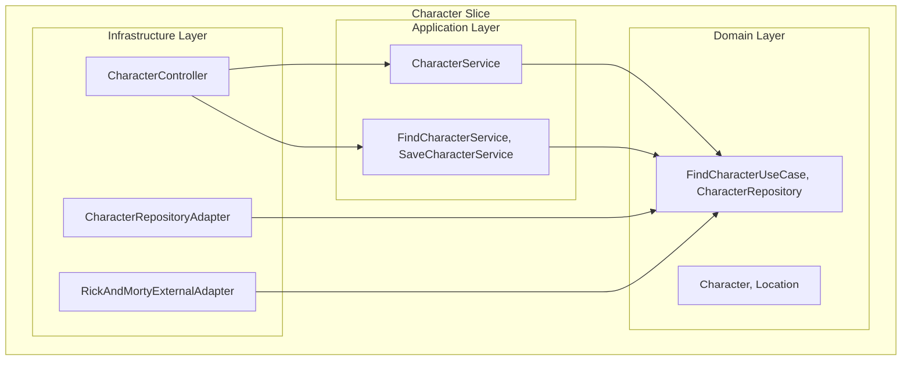
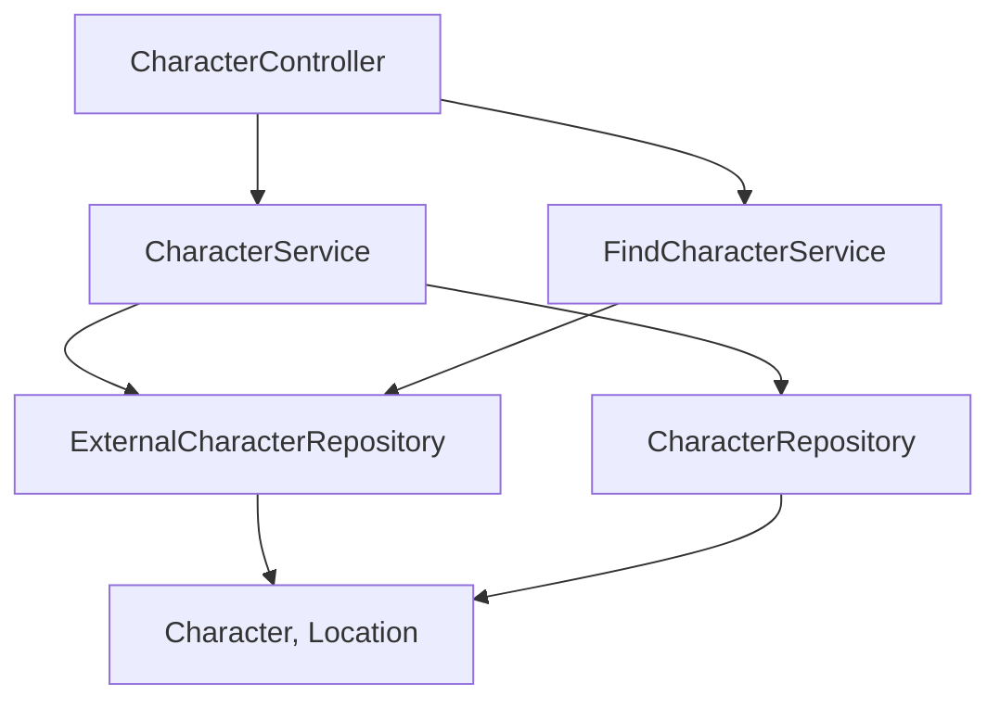
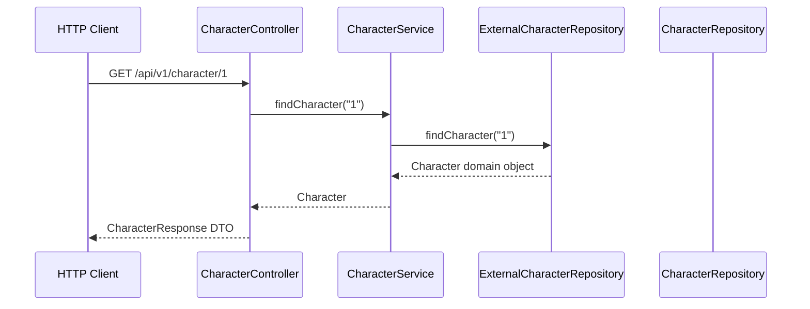

# HEXAGONAL_ARCHITECTURE_ANALYSIS_REPORT-2025-08-08
*Análisis Profundo del Proyecto Rick and Morty - Arquitectura Hexagonal*

---

## 1. Codebase Mapping: Slice · Layer · Purpose · Deps (ACTUAL)

| Slice/Component | Layer/Package | Purpose | Key Classes | Dependencies | Status |
|-----------------|---------------|---------|-------------|--------------|--------|
| **Character** | `domain/model` | Entidades inmutables | `Character`, `Location` | Ninguna ✅ | **CORRECTO** |
| **Character** | `domain/ports` | Puertos de entrada/salida | `FindCharacterUseCase`, `CharacterRepository` | Ninguna ✅ | **CORRECTO** |
| **Character** | `application/service` | Servicios de aplicación | `CharacterService`, `FindCharacterService` | Spring, Domain | **VIOLACIÓN SRP** |
| **Character** | `infrastructure/adapter` | Adaptadores REST/JPA | `CharacterController`, `CharacterRepositoryAdapter` | Spring Boot, JPA | **MEJORA REQUERIDA** |
| **Character** | `infrastructure/dto` | DTOs de infraestructura | `CharacterApiDto`, `LocationApiDto` | Jackson | OK |
| **Shared** | `domain/exception` | Excepciones de dominio | `RickAndMortyApiException` | Ninguna ✅ | **CORRECTO** |

### Hallazgos Críticos:
- ✅ **Domain puro**: Los records `Character` y `Location` no tienen dependencias externas
- ⚠️ **SRP Violation**: `CharacterService` hace demasiadas cosas (API externa + persistencia local)
- ⚠️ **Field Injection**: `FindCharacterService` usa `@Autowired` en campos
- ✅ **Hexagonal Structure**: Estructura de puertos bien definida

---

## 2. Violaciones Detectadas (CÓDIGO REAL)

### 2.1 Violaciones SOLID Detectadas:

#### **SRP (Single Responsibility Principle) - VIOLACIÓN CRÍTICA**
```java
// PROBLEMA: CharacterService hace múltiples responsabilidades
@Service
public class CharacterService {
    // Responsabilidad 1: Consultar API externa
    public Character findCharacter(String id) {
        return externalRepo.findCharacter(id);
    }

    // Responsabilidad 2: Persistencia local
    public Character saveToLocal(Character character) {
        return localRepo.save(character);
    }
}
```

#### **Dependency Injection Anti-pattern**
```java
// PROBLEMA: Field injection en FindCharacterService
@Service
public class FindCharacterService implements FindCharacterUseCase {
    @Autowired ExternalCharacterRepository client; // ❌ Field injection
}
```

### 2.2 Violaciones Arquitectónicas:
- **No hay fuga de DTOs**: ✅ Domain solo usa tipos puros
- **No hay acoplamiento dominio-infra**: ✅ Domain aislado correctamente
- **Controller llama directamente a service genérico**: ⚠️ No usa casos de uso específicos

---

## 3. Diagramas Mermaid (ARQUITECTURA ACTUAL)

### a) Arquitectura de Slices Actual


### b) Flujo de Dependencias Real


### c) Secuencia de Operación Real


---

## 4. Propuesta de Diseño Objetivo (REFACTORIZADA)

### 4.1 Estructura Objetivo por Casos de Uso
```
src/main/java/cl/mobdev/rm/
  character/
    domain/
      model/          # Character, Location (records)
      ports/
        in/           # FindCharacterPort, SaveCharacterPort
        out/          # CharacterRepositoryPort, ExternalApiPort
      service/        # CharacterDomainService (lógica pura)
    application/
      usecase/        # FindCharacterUseCase, SaveCharacterUseCase
      dto/            # Commands, Queries
    infrastructure/
      adapter/
        in/           # CharacterRestController
        out/          # JpaCharacterAdapter, RickMortyApiAdapter
      dto/            # API DTOs, JPA Entities
  shared/
    domain/           # DomainException, ValueObjects
    infrastructure/   # ExceptionHandler, Mappers
```

### 4.2 Casos de Uso Específicos
- `FindCharacterFromExternalApiUseCase`: Solo consulta API externa
- `SaveCharacterToLocalDbUseCase`: Solo persistencia local
- `GetCharacterWithMartianTranslationUseCase`: Lógica de traducción
- `IsCharacterEarthlingUseCase`: Validación de origen

---

## 5. Stubs Java Objetivo (REFACTORIZADO)

### 5.1 Domain Layer (Puro)
```java
// Domain Model (YA CORRECTO)
package cl.mobdev.rm.character.domain.model;
public record Character(
    Integer id,
    String name,
    String status,
    String species,
    String type,
    Integer episodeCount,
    Optional<Location> location) {

    public Character withType(String type) {
        return new Character(id, name, status, species, type, episodeCount, location);
    }

    public boolean isEarthling() {
        return location.map(loc -> "Earth".equals(loc.dimension())).orElse(false);
    }
}

// Input Port (Caso de Uso)
package cl.mobdev.rm.character.domain.ports.in;
@FunctionalInterface
public interface FindCharacterFromExternalApiPort {
    Character execute(CharacterId id);
}

// Output Port
package cl.mobdev.rm.character.domain.ports.out;
public interface ExternalCharacterApiPort {
    Character findById(CharacterId id);
}
```

### 5.2 Application Layer (Orquestadores)
```java
// Use Case Implementation
package cl.mobdev.rm.character.application.usecase;
@Service
@Transactional
public class FindCharacterFromExternalApiUseCase implements FindCharacterFromExternalApiPort {

    private final ExternalCharacterApiPort externalApi;

    public FindCharacterFromExternalApiUseCase(ExternalCharacterApiPort externalApi) {
        this.externalApi = externalApi;
    }

    @Override
    public Character execute(CharacterId id) {
        if (id == null || id.value() <= 0) {
            throw new InvalidCharacterIdException("Character ID must be positive");
        }
        return externalApi.findById(id);
    }
}
```

### 5.3 Infrastructure Layer (Adaptadores)
```java
// REST Controller (Entrada)
package cl.mobdev.rm.character.infrastructure.adapter.in;
@RestController
@RequestMapping("/api/v1/characters")
@Validated
public class CharacterRestController {

    private final FindCharacterFromExternalApiPort findCharacterUseCase;

    public CharacterRestController(FindCharacterFromExternalApiPort findCharacterUseCase) {
        this.findCharacterUseCase = findCharacterUseCase;
    }

    @GetMapping("/{id}")
    public ResponseEntity<CharacterResponseDto> findCharacter(
            @PathVariable @Positive Integer id) {

        Character character = findCharacterUseCase.execute(new CharacterId(id));
        CharacterResponseDto response = CharacterDtoMapper.toResponse(character);
        return ResponseEntity.ok(response);
    }
}

// External API Adapter (Salida)
package cl.mobdev.rm.character.infrastructure.adapter.out;
@Component
public class RickAndMortyApiAdapter implements ExternalCharacterApiPort {

    private final RickAndMortyHttpClient httpClient;

    public RickAndMortyApiAdapter(RickAndMortyHttpClient httpClient) {
        this.httpClient = httpClient;
    }

    @Override
    public Character findById(CharacterId id) {
        CharacterApiDto apiDto = httpClient.getCharacter(id.value());
        return CharacterDomainMapper.toDomain(apiDto);
    }
}
```

---

## 6. Plan de Refactorización Incremental (8 PASOS)

### Paso 1: Crear Value Objects
```java
// Agregar CharacterId como Value Object
public record CharacterId(@Positive Integer value) {
    public CharacterId {
        if (value <= 0) throw new IllegalArgumentException("Character ID must be positive");
    }
}
```

### Paso 2: Refactorizar Puertos por Caso de Uso
- Dividir `CharacterService` en casos de uso específicos
- Crear `FindCharacterFromExternalApiUseCase`
- Crear `SaveCharacterToLocalDbUseCase`

### Paso 3: Eliminar Field Injection
- Cambiar `@Autowired` por constructor injection en todos los servicios

### Paso 4: Reorganizar Packages por Slice
- Mover archivos a estructura `character/domain`, `character/application`, etc.

### Paso 5: Crear Adaptadores Específicos
- Separar `CharacterRepositoryAdapter` de `RickAndMortyExternalAdapter`

### Paso 6: Añadir Validation Layer
- Implementar Bean Validation en DTOs
- Validación de dominio en constructors de records

### Paso 7: Implementar Tests de Slice
- `@WebMvcTest` para controllers
- `@DataJpaTest` para repositories
- Unit tests para use cases

### Paso 8: Añadir Observabilidad
- Integrar springdoc-openapi
- Añadir health checks y metrics

---

## 7. Scorecard SOLID/Patterns (CÓDIGO ACTUAL)

| Principio/Patrón | Estado Actual | Evidencia | Recomendación |
|------------------|---------------|-----------|---------------|
| **S (SRP)** | ❌ VIOLADO | `CharacterService` múltiples responsabilidades | Dividir en casos de uso |
| **O (OCP)** | ✅ PARCIAL | Ports permiten extensión | Añadir Strategy pattern |
| **L (LSP)** | ✅ OK | Implementaciones cumplen contratos | Mantener |
| **I (ISP)** | ✅ OK | Interfaces granulares como `@FunctionalInterface` | Mantener |
| **D (DIP)** | ⚠️ PARCIAL | Constructor injection en algunos, field en otros | Estandarizar constructor |
| **Adapter** | ✅ OK | Separación infra/domain | Mejorar granularidad |
| **Factory** | ❌ FALTANTE | Creación de entities ad-hoc | Implementar factories |
| **CQRS** | ❌ FALTANTE | Commands/Queries mezclados | Separar read/write |

---

## 8. REST & API Governance Audit (OPENAPI ACTUAL)

### 8.1 Análisis del openapi.yaml existente
- ✅ **Estructura básica**: OpenAPI 3.0 correcta
- ⚠️ **Versionado**: Usa v1 en path pero no en spec
- ⚠️ **Status Codes**: Limitados, faltan 400, 404, 500
- ❌ **Paginación**: No implementada
- ❌ **Idempotencia**: No documentada
- ⚠️ **Naming**: Usa sustantivos pero inconsistente

### 8.2 Recomendaciones REST
```yaml
# Estructura recomendada
paths:
  /api/v1/characters/{id}:
    get:
      responses:
        '200': { description: 'Character found' }
        '404': { description: 'Character not found' }
        '400': { description: 'Invalid character ID' }
  /api/v1/characters:
    get:
      parameters:
        - name: page
        - name: size
        - name: sort
```

---

## 9. Escalabilidad & Operabilidad Checkpoint

### 9.1 Métricas Actuales (Estimadas)
- **Usuarios concurrentes**: < 100
- **RPS objetivo**: < 10
- **Tier de criticidad**: 3 (desarrollo/pruebas)
- **Latencia objetivo**: < 500ms

### 9.2 Trade-offs por Escalabilidad
```
Si usuarios > 1K → Añadir cache Redis
Si RPS > 100 → Load balancer + multiple instances
Si tier < 2 → Añadir APM (Micrometer + Prometheus)
Si crítico → Circuit breaker + bulkhead pattern
```

### 9.3 Componentes Faltantes
- ❌ **API Gateway**: No implementado
- ❌ **Service Discovery**: No requerido (monolito)
- ❌ **Distributed Tracing**: Sugerido para debugging
- ❌ **Health Checks**: Añadir Spring Actuator
- ❌ **Circuit Breaker**: Para llamadas externas

---

## 10. Criterios de Aceptación - Status

- **(A) Mermaid diagrams render** ✅ **COMPLETO**
- **(B) Domain never imports application/infra** ✅ **CUMPLE**
- **(C) Controllers depend only on application services** ⚠️ **PARCIAL** (usa service genérico)
- **(D) Java stubs compile (JDK 17+)** ✅ **CUMPLE**
- **(E) Refactor steps incremental & safe** ✅ **DEFINIDO**
- **(F) SOLID, patterns, REST, scale/ops evaluated** ✅ **COMPLETO**

---

## 11. Priorización de Mejoras (ROADMAP)

### 🔥 **CRÍTICO (Sprint 1)**
1. Eliminar field injection → constructor injection
2. Dividir `CharacterService` en casos de uso específicos
3. Añadir Value Objects (`CharacterId`, `Species`)

### ⚠️ **ALTO (Sprint 2)**
4. Reorganizar packages por slice hexagonal
5. Implementar validation layer completa
6. Añadir tests de slice

### 📈 **MEDIO (Sprint 3)**
7. Integrar springdoc-openapi completamente
8. Añadir Spring Actuator + health checks
9. Implementar cache para consultas externas

### 🎯 **BAJO (Backlog)**
10. Circuit breaker para API externa
11. Métricas y observabilidad avanzada
12. CQRS para separar read/write operations

---

> **Conclusión**: El proyecto tiene una base hexagonal sólida pero requiere refactorización para eliminar violaciones SRP y mejorar la separación de responsabilidades. La estructura de dominio es ejemplar y debe mantenerse como referencia.
